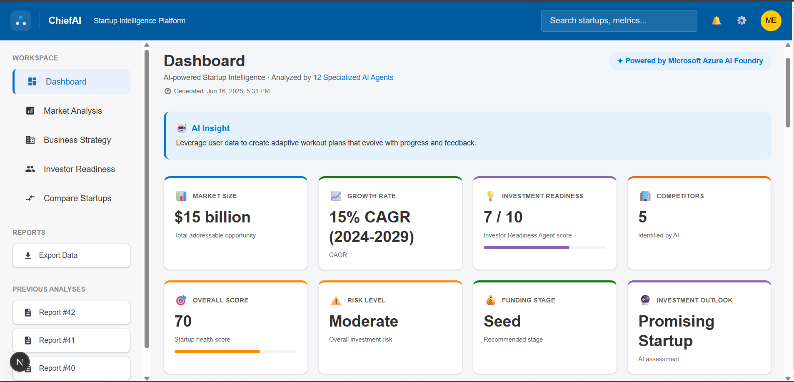
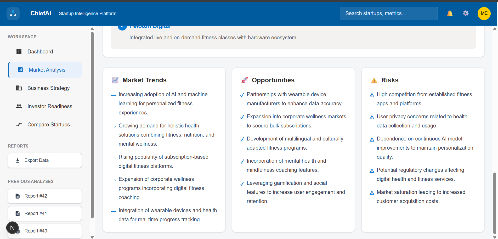
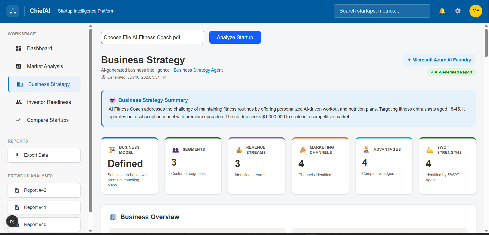
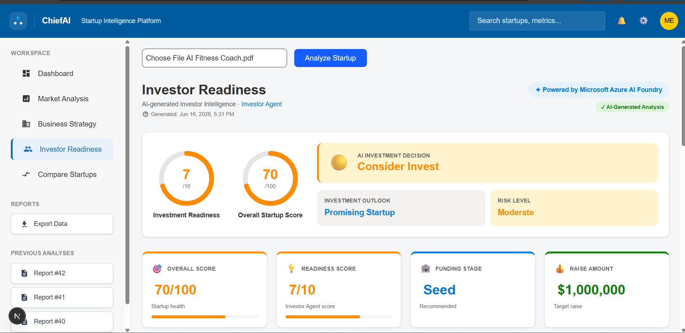
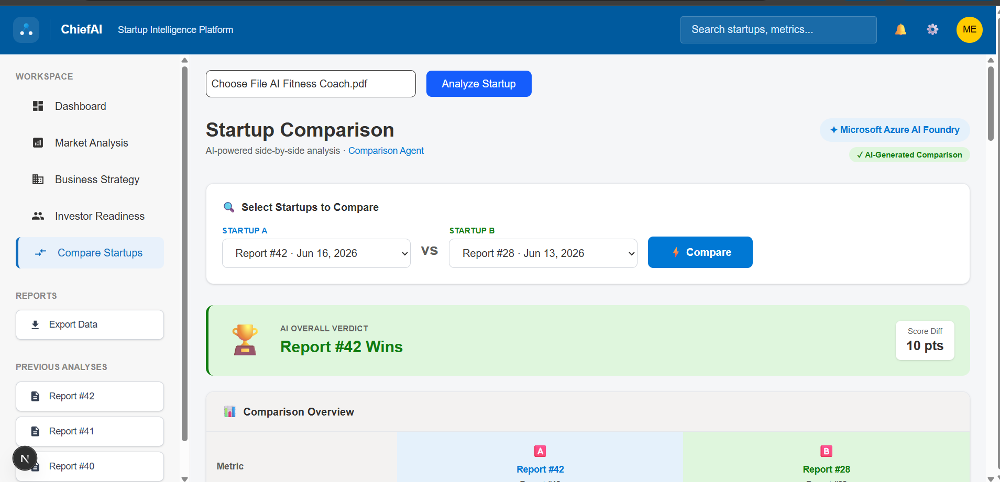
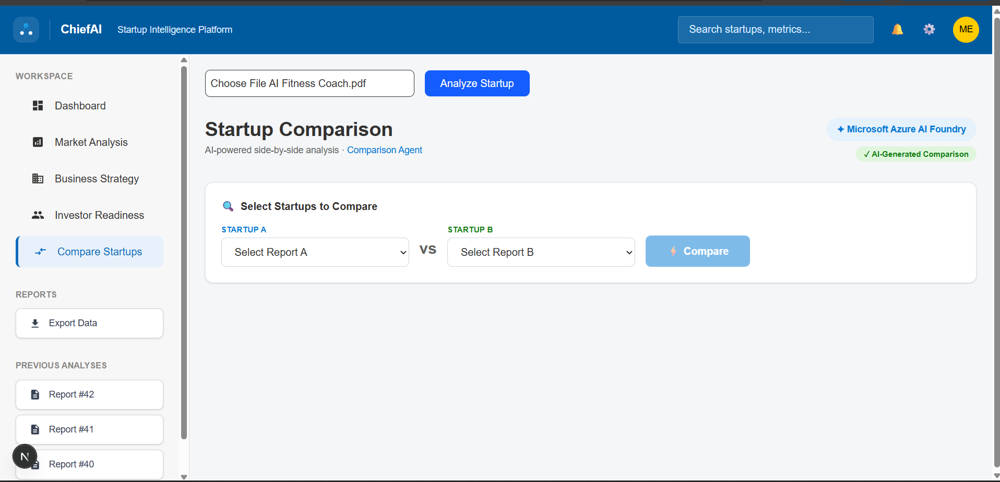

# 🚀 ChiefAI – Multi-Agent Startup Intelligence Platform

<p align="center">


</p>

<p align="center">
<b>An AI-powered Multi-Agent platform that transforms startup ideas into investor-ready business intelligence.</b>
</p>

---

# Platform Preview

<p align="center">

</p>

---

# The Problem

Every day, thousands of startup founders prepare pitch decks and business proposals.

Before approaching investors, they need answers to questions like:

- Is there a real market opportunity?
- Is the business model sustainable?
- Who are the competitors?
- How investment-ready is the startup?
- What are the biggest risks?
- What funding should be raised?
- How can the startup improve?

Finding these answers usually requires multiple experts including:

- Business Consultants
- Market Analysts
- Investors
- Financial Advisors
- Startup Mentors

This process is expensive, time-consuming, and often inaccessible to early-stage founders.

---

# Our Solution

ChiefAI acts as an **AI-powered startup advisory board**.

Instead of relying on a single AI response, ChiefAI uses **multiple specialized AI agents**, where each agent independently analyzes one aspect of the startup.

The agents collaborate through an orchestrator to generate a single comprehensive startup intelligence report.

The result is a platform that helps founders make informed business decisions before approaching investors.

---

# What We Built

ChiefAI is a **Multi-Agent Startup Intelligence Platform** capable of:

- 📄 Analyzing startup proposal PDFs
- 🤖 Running multiple AI agents simultaneously
- 📈 Evaluating market opportunity
- 💼 Generating business strategy
- 💰 Assessing investment readiness
- ⚠ Identifying startup risks
- 📊 Producing SWOT analysis
- 🧠 Creating executive summaries
- 🚀 Recommending growth opportunities
- 📑 Exporting investor-ready reports
- 📚 Maintaining report history
- 🔄 Comparing different startups or different versions of the same startup over time

---

# Platform Overview

| Dashboard | Market Analysis |
|------------|-----------------|
|  |  |

| Business Strategy | Investor Readiness |
|-------------------|--------------------|
|  |  |

| Compare Startups | Report History |
|------------------|----------------|
|  |  |

---

# Multi-Agent Architecture

```
                     Startup Proposal (PDF)
                              │
                              ▼
                     PDF Processing Service
                              │
                              ▼
                  Startup Orchestrator Agent
                              │
     ───────────────────────────────────────────────────

        │         │          │         │         │

        ▼         ▼          ▼         ▼         ▼

 Market Agent  Business   Investor   Strategy   Risk
               Agent      Agent      Agent      Agent

        │         │          │         │         │

        ▼         ▼          ▼         ▼         ▼

 SWOT Agent  Research  Executive  Funding  Presentation
             Agent      Summary    Agent       Agent

                    │
                    ▼

        Unified Startup Intelligence Report

                    │

                    ▼

        Interactive Dashboard + PDF Export
```

---

# AI Agents

ChiefAI consists of **12 autonomous AI agents**, each responsible for a specific business domain.

| Agent | Responsibility |
|--------|----------------|
| 📈 Market Agent | Market size, industry trends, TAM, SAM, SOM |
| 💼 Business Agent | Business model, revenue streams, pricing |
| 💰 Investor Agent | Funding readiness and investment scoring |
| ⚠ Risk Agent | Startup risks and mitigation strategies |
| 🏢 Competitor Agent | Competitor discovery and benchmarking |
| 📊 SWOT Agent | Strengths, Weaknesses, Opportunities, Threats |
| 🚀 Strategy Agent | Growth roadmap and scaling strategy |
| 📚 Research Agent | Industry insights and recommendations |
| 📝 Executive Summary Agent | Executive summary and AI recommendations |
| 💵 Funding Agent | Funding recommendation |
| 🎨 Presentation Agent | Investor pitch generation |
| ⚙ Execution Agent | Startup execution roadmap |

---

# System Workflow

```
Upload Startup Proposal

        │

        ▼

Extract Startup Information

        │

        ▼

Launch AI Agents in Parallel

        │

        ▼

Individual Analysis

        │

        ▼

Agent Orchestrator

        │

        ▼

Unified Startup Intelligence Report

        │

        ▼

Interactive Dashboard

        │

        ▼

PDF Export & Report History
```

---

# Key Features

### Dashboard

- Executive Summary
- Startup Health Score
- AI Insights
- Funding Recommendation
- Startup Metrics

---

### Market Analysis

- Market Size
- Industry Growth
- TAM
- SAM
- SOM
- Market Trends

---

### Business Strategy

- Business Model
- Customer Segments
- Revenue Streams
- Pricing Strategy
- Value Proposition

---

### Investor Readiness

- Investment Score
- Funding Recommendation
- Startup Health
- Growth Potential
- Risk Evaluation

---

### Compare Startups

ChiefAI can compare:

- Two different startups
- The same startup across different timelines

allowing founders to measure progress over time.

---

### Report History

Every startup analysis is automatically stored, making previous reports easily accessible.

---

### Export Reports

Generate downloadable PDF reports for founders, mentors, accelerators, or investors.

---

# Project Structure

```
ChiefAI
│
├── assets/
│   ├── platform screenshots
│   └── architecture diagrams
│
├── backend/
│   ├── app/
│   │
│   ├── agents/
│   │     Individual AI agents
│   │
│   ├── services/
│   │     Azure AI, PDF, JSON and utility services
│   │
│   ├── api/
│   │     FastAPI endpoints
│   │
│   ├── orchestrator.py
│   │     Coordinates all AI agents
│   │
│   └── main.py
│         FastAPI application
│
├── frontend/
│   ├── app/
│   ├── components/
│   ├── services/
│   └── styles/
│
├── architecture/
│
├── demo/
│
├── docs/
│
└── README.md
```

---

# Technology Stack

### Frontend

- Next.js
- React
- TypeScript
- Tailwind CSS

### Backend

- FastAPI
- Python 3.11

### AI

- Azure AI Foundry
- Azure OpenAI GPT-4.1

### Database

- SQLite

### Report Generation

- ReportLab
- PDF Processing

---

# Getting Started

## Clone Repository

```bash
git clone https://github.com/Amreen-B/ChiefAI.git

cd ChiefAI
```

---

## Backend

```bash
cd backend

python -m venv venv

venv\Scripts\activate

pip install -r requirements.txt

uvicorn app.main:app --reload
```

Create a `.env` file

```
AZURE_AI_ENDPOINT=

AZURE_AI_KEY=

AZURE_DEPLOYMENT_NAME=
```

---

## Frontend

```bash
cd frontend

npm install

npm run dev
```

Visit

```
http://localhost:3000
```

---

# Future Improvements

- Multi-language startup analysis
- Live market intelligence APIs
- Team collaboration
- AI pitch deck generation
- Financial forecasting
- Founder recommendation engine
- Azure cloud deployment
- Agent memory for iterative startup improvements

---

# Why Multi-Agent?

Instead of asking one LLM to perform every task, ChiefAI distributes responsibilities among specialized AI agents.

This architecture provides:

- Better modularity
- Easier scalability
- Improved reasoning
- Parallel execution
- More reliable outputs
- Separation of responsibilities

---

# Built For

- Startup Founders
- Entrepreneurs
- Incubators
- Accelerators
- Investors
- Venture Capital Firms
- University Innovation Labs

---

# Demo

Demo video:

```
demo/demo.mp4
```

---

# Documentation

Project documentation is available inside:

```
docs/
```

---

# Microsoft Agents League Hackathon

ChiefAI was built as a submission for the **Microsoft Agents League Hackathon**.

The project demonstrates how multiple AI agents can collaborate through orchestration to solve a complex real-world business problem—transforming startup proposals into structured, actionable, investor-ready intelligence.

---

# 🏆 Microsoft Agents League Hackathon

ChiefAI was developed as a submission for the **Microsoft AI Agents League Hackathon**, demonstrating how autonomous AI agents can collaborate to solve complex startup evaluation tasks.

---

# 📄 License

This project is licensed under the MIT License.

---

# 👨‍💻 Author

**Amreen Begum**

Built with 🧠 using Microsoft Azure AI Foundry and Azure OpenAI.
